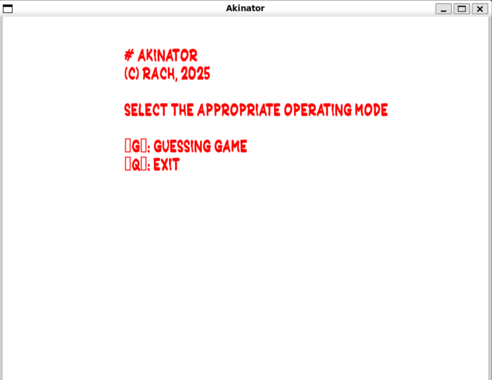
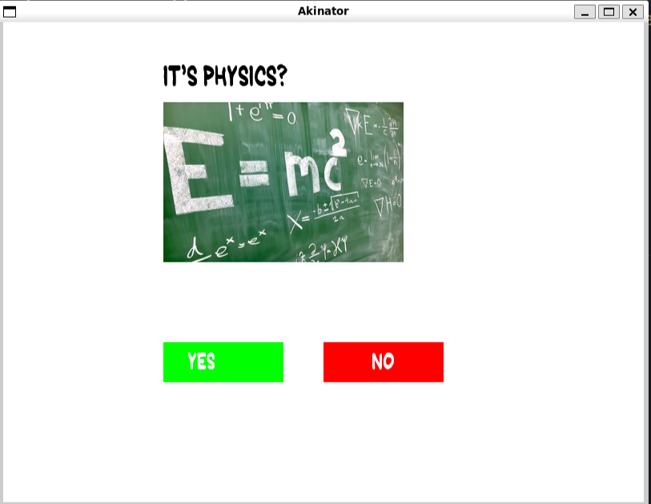
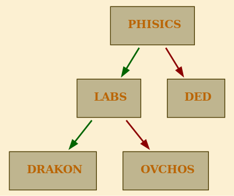

# Akinator

Akinator is an interactive game in which the program tries to guess a character conceived by the user by asking a sequence of logically structured questions. The basic idea is a learning tree that expands and refines with each game run.

## Features

- **CLI** mode: classic text mode
- **GUI** mode: with SFML based GUI
- **Guessing** a conceived object
- **Adding** new objects and clarifying questions
- **Defining** an object (how to describe it with questions)
- **Finding** differences between two objects
- Saving a new knowledge base
- Logging support


## 🖼️ GUI Version (SFML)

The **GUI** version provides a more interactive experience. You can click buttons, see character images, and navigate visually through the game.

> [!WARNING]
> The GUI version is built with **SFML 2.5.1**.
> Please make sure to use **exactly this version**, as other versions may cause unexpected behavior or compilation issues.


### 🕹️ How to Use

Once the GUI is open, you'll see a window like this:



The current question or guess is shown in the center of the screen.

Below the question, you have several buttons:

| Button          | Description                                      |
|-----------------|--------------------------------------------------|
| ✅ **Yes**       | Select "Yes" for the current question            |
| ❌ **No**        | Select "No" for the current question             |




> [!NOTE]
> If you are using GUI mode, to display the image of a new object correctly you need to:
>
> - Place the character image in the `images/` folder
> - Name the image file exactly the same as the object name or question
> - Do **not** use punctuation in the filename
> - Supported format: `.jpg`

## Console Version

In the console version, you can answer the questions with the following options:

| Button     | Description                                      |
|------------|--------------------------------------------------|
| ✅ `Yes`      | Answer "Yes" to the current question or guess    |
| ❌ `No`       | Answer "No" to the current question or guess     |
| 🤷‍♂️ `Unknown`  | Answer "I don't know" or "Not sure"              |

> [!NOTE]
> New database is saved to the file `akinator/new_base.txt`. You can specify your own file by using the `-o` flag when running the program.


## 📚 **Database Structure**

The **Akinator database** is stored in a text format, where each entry represents a question or an object. The structure consists of:

- **Questions**: Represented by a `?question?` and enclosed in curly braces `{}`. Questions help guide the game towards the correct guess.
- **Objects**: Represented by `<object_name>`, enclosed in angle brackets `<>`. These are the objects the game tries to guess.

Here's an example of a database entry:

```
PHISICS?
{
    ?LABS?
    {
        <DRAKON>
    }
    {
        <OVCHOS>
    }
}
{
    <DED>
}
```

An example of how it will look like in a binary tree:




### 📂 Adding New Objects to the Database

To add a new object to the database:

1. Run the game and select the `Add` button when the game fails to guess the character.
2. The program will ask you to specify a new question and associate it with a possible object.
3. The new object will be saved in the database.


🛠️ **Building and Running the GUI Version**

To build and launch the GUI version of the Akinator, run the following commands in your terminal:

```
cd AkinatorGUI
make
./do
```

🛠️ **Building and Running the Console Version**

To build and launch the console version of Akinator, simply run the following command:

```
make
./do -i akinator/base.txt
```
